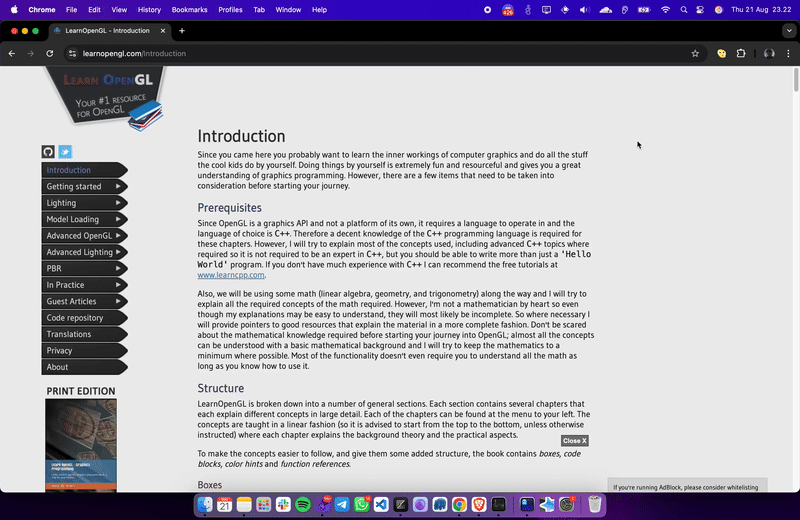

# Sync Text Into Your Anki (Chrome Extension)

A minimal Chrome extension that lets you add notes to your Anki collection directly from the browser. It talks to Anki via the AnkiConnect add-on running locally and saves notes automatically into the selected deck.

This extension:
- Loads your deck list from Anki (via AnkiConnect).
- Creates a Basic note with Front, Back, and optional Tags using the `addNote` action.
- Saves directly into the chosen deck (no additional confirmation dialog).

---

## Demo (GIF) how to use the extension

## Prerequisites

1) Anki Desktop
- Download and install Anki: https://apps.ankiweb.net

2) AnkiConnect Add-on (ID: 2055492159)
- Anki → Tools → Add-ons → Get Add-ons…
- Paste this code: 2055492159
- Restart Anki after installation.
- Reference: https://ankiweb.net/shared/info/2055492159
- Full docs: https://git.sr.ht/~foosoft/anki-connect/

3) Chrome
- Version that supports Manifest V3 extensions (any current Chrome/Chromium-based browser).

---

## AnkiConnect configuration (CORS)

This extension makes requests from a Chrome extension origin (e.g., `chrome-extension://<your-extension-id>`). To allow AnkiConnect to accept requests from your extension:

1) Find your extension ID
- Open `chrome://extensions`
- Enable “Developer mode”
- Load this project as “Load unpacked” (see Install the extension below)
- Copy the ID shown under this extension.

2) Configure AnkiConnect to allow your extension origin
- In Anki: Tools → Add-ons → select “AnkiConnect” → Config
- Add your extension origin to `webCorsOriginList`, for example:

    {
      "apiKey": "",
      "webBindAddress": "127.0.0.1",
      "webBindPort": 8765,
      "webCorsOriginList": [
        "chrome-extension://YOUR_EXTENSION_ID"
      ]
    }

3) Save and restart Anki.

Notes:
- If you have set an API key in AnkiConnect config, you’ll also need to modify the extension’s `script.js` to include a `key` field in every request payload sent to AnkiConnect.

---

## Install the extension

1) Clone or download this repository.
2) Open Chrome and navigate to `chrome://extensions`.
3) Enable “Developer mode”.
4) Click “Load unpacked” and select the `chrome-extension` folder.
5) Confirm the extension is loaded and note the extension ID (used in the CORS config step above).

Manifest (already set in this project):
- Host permissions are restricted to `http://localhost:8765/*` (AnkiConnect default).

---

## Usage

1) Start Anki Desktop and ensure the AnkiConnect add-on is enabled.
2) Open the extension’s popup (click the extension icon).
3) Wait for the deck dropdown to populate. If it doesn’t, see Troubleshooting.
4) Fill in:
   - Deck: choose an existing deck.
   - Tags: optional, comma-separated (e.g., `web,reading,biology`).
   - Front: your prompt/front text.
   - Back: your answer/back text.
5) Click “Add”.
6) You should see “Card added to deck successfully.” The note is immediately saved.

To verify, open Anki’s Browser and check the chosen deck.

---

## What’s created

- Model: `Basic`
- Fields: `Front`, `Back`
- Tags: whatever you entered (comma-separated)

If you use a custom model or different field names, see Customization.

---

## Customization

- Change model/fields
  - File: `chrome-extension/script.js`
  - Find where the note is created (look for `modelName: 'Basic'` and `fields: { Front: ..., Back: ... }`).
  - Update `modelName` to your model (e.g., `Basic (and reversed card)` or your custom model).
  - Update `fields` keys to match your model’s field names.

- Add API key (if configured in AnkiConnect)
  - If you set `"apiKey"` in AnkiConnect config, modify the payloads sent in `script.js` to include a top-level `"key": "YOUR_API_KEY"` alongside `"action"`, `"version"`, and `"params"`.

- Endpoint/port
  - Default is `http://localhost:8765`. If you change AnkiConnect’s port or bind address, update the URL in `script.js` and the host permissions in `manifest.json`.

---

## Troubleshooting

- “Could not connect to AnkiConnect”
  - Ensure Anki Desktop is running.
  - Ensure the AnkiConnect add-on is installed and enabled.
  - Verify AnkiConnect port (default 8765) matches the extension’s configuration.
  - Check firewall settings that might block localhost.

- “AnkiConnect error: origin not allowed”
  - Add your extension origin to `webCorsOriginList` in AnkiConnect’s config (see CORS section).

- Deck list doesn’t load
  - Make sure Anki is open.
  - Confirm `webBindAddress` and `webBindPort` in AnkiConnect match the extension’s `http://localhost:8765` target.
  - Check the Anki Console (in Anki: Tools → Add-ons → AnkiConnect → View Files → check logs if any).
  - Open the browser console for the popup (right-click popup → Inspect) to see the exact error.

- Note not appearing in the expected deck
  - Confirm you selected the correct deck.
  - Verify your model/field names if you customized them.

---

## Reference: AnkiConnect actions used

- List decks

        curl localhost:8765 -X POST -d '{"action": "deckNamesAndIds", "version": 6}'

  Example response:

        {
          "result": {
            "Default": 1
          },
          "error": null
        }

  The extension primarily calls `deckNames`, and falls back to `deckNamesAndIds` if needed.

- Add note (auto-save)

        {
          "action": "addNote",
          "version": 6,
          "params": {
            "note": {
              "deckName": "Default",
              "modelName": "Basic",
              "fields": {
                "Front": "Front text",
                "Back": "Back text"
              },
              "tags": ["web", "reading"]
            }
          }
        }

---

## Project structure (key files)

- `manifest.json` — Chrome extension manifest (MV3). Host permissions target `http://localhost:8765/*`.
- `index.html` — Popup UI markup.
- `style.css` — Popup UI styling.
- `script.js` — Logic to load decks and add notes via AnkiConnect.
- `docs/demo.gif` — Optional demo GIF referenced in the README (create the `docs` folder if needed).

---

## Privacy & Security

- All requests go to your local AnkiConnect instance at `http://localhost:8765`.
- No data is sent to third-party servers by this extension.
- If you choose to set an AnkiConnect API key, store it securely and update the extension code to include it in requests.

---

## License and Credits

This project is licensed under a Custom License - see the [LICENSE](LICENSE) file for details.
- Free for personal, educational, and non-commercial use
- Commercial use requires licensing and payment - contact the author for commercial licensing

- Built to interoperate with the excellent Anki SRS and the AnkiConnect add-on.
- AnkiConnect is authored and maintained by its contributors: https://git.sr.ht/~foosoft/anki-connect/
- This project is not affiliated with the Anki team or AnkiConnect maintainers.

Happy studying!